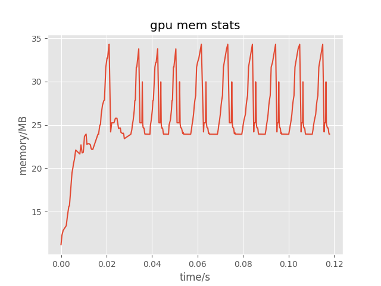

# A Memory Tracer For PyTorch

OOM is a nightmare for PyTorch users.
However, most of them do not know the exact memory footprint during training.
This project helps you depict the GPU memory usage changing curve during training.
We record the peak GPU memory of an operator at the moment of the operator finished.
The operator can be computing of a FWD submodule or a BWD submodule.

## Usage
```
python train.py 
python visualize.py memstats.pkl
```


